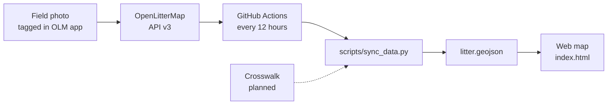

# MROLM — Maple Ridge OpenLitterMap

**An open citizen-science project that turns litter observations from Maple Ridge, British Columbia into a free, automatically updated public map and a locally meaningful dataset.**

Litter is photographed and tagged in the field using [OpenLitterMap](https://openlittermap.com) (OLM). This repository pulls those records from the OLM API, reshapes them for local use, and publishes them as an interactive web map. The goal is good open data for citizen science: a consistent, well-documented record of where litter is, what it is, and how that changes over time. The local categories (the crosswalk) were built using the City of Vancouver litter audit and Maple Ridge municipal classifications as guides.

*Last updated: September 25, 2026*

> **Status: working proof of concept.** Not ready for public use yet. A license and contributor guide will be added once the proof of concept works.

---

## Project status at a glance

| Area | Status | Notes |
|---|---|---|
| Data pipeline (OLM API → GeoJSON) | ✅ Built | Runs automatically every 12 hours |
| Public web map | ✅ Built | Three basic filters: Litter, Pet Waste, Nicotine/THC/Alcohol |
| Crosswalk logic and layer tree design | ✅ Designed | Exported to `config/crosswalk.csv`. Structure reviewed and clean |
| Crosswalk engine (code that applies the crosswalk) | ⬜ Planned | Will read the crosswalk as a CSV file |
| Layer tree map interface | ⬜ Planned | Expandable Group → Subgroup → Layer checkboxes |
| GIS features on the map | ⬜ Planned | After the layer tree and the legacy review (Stage 3) |
| Municipal waste streams | ⬜ Later | Communicating the data in municipal terms, built last (Stage 4) |
| Cleanup of older tags in OLM | 🟡 In progress | The maintainer is reclassing legacy tags in OLM by hand (roadmap step 4) |

---

## Proof of concept: definition of done

The proof of concept is done when all of these are true:

1. **The engine applies the crosswalk.** Every run reads `config/crosswalk.csv` and puts each tag into exactly one layer, following the matching rules below. Unmapped = 0.
2. **The audit report is published on every run**, with the counts in the audit table below. Tie-breaks are reviewed and either fixed in the crosswalk or accepted.
3. **The layer tree works on the live map:** Group → Subgroup → Layer checkboxes that cascade, item counts that roll up, empty layers hidden, and full layer names in popups.
4. **Counts are spot-checked.** For about five layers, the map count matches a manual count of the same tags in OLM.
5. **Legacy data is conformed enough to trust.** Not used = 0 and UNCLASS = 0. Orphan tags are tracked in the audit with their photo IDs and fixed in OLM, or accepted as a known gap. The REVIEW backlog is tracked by Claude, which rebuilds the review workbook after the maintainer's OLM edits, and its remaining count is recorded in the progress log at each check.
6. **The pipeline stays safe.** An incomplete fetch leaves the last good data live, and the tree map data is produced by the workflow without manual fixes.
7. **A basic test exists** for crosswalk matching: a specific row beats the plain row, blank falls back, capitals and spacing are ignored, and the first match wins.
8. **A newcomer can understand it in five minutes.** The README opens with what the map shows, and the live link works.

Not part of the proof of concept: GIS features, municipal streams, a license, and a contributor guide.

---

## Progress log

Newest first, one line per change. Claude updates this whenever it updates the README.

- **2026-09-26:** README now lists exactly which fields the pipeline publishes per point.
- **2026-09-25:** Working method recorded: work directly on `main`, test locally, no branches or staging site. Audit and reporting are the top priority for the engine build.
- **2026-09-25:** Crosswalk finished and re-exported after review; municipal stream columns removed. Pipeline now logs in again on a rejected token, keeps groups in a stable order, rebases before pushing, and keeps OLM's object type. Tagging protocol, decision log, and hardening list moved to `docs/`. Proof-of-concept criteria added.
- **2026-09-24:** Fixed the photo cap that had cut the map short; an incomplete fetch now fails the sync instead of publishing partial data. Page requests retry with increasing waits.
- **2026-09-17:** Stage 1 complete: automated 12-hour pipeline, GeoJSON output, and a basic filter map on GitHub Pages.

---

## Why this project exists

OpenLitterMap uses one global tagging system for litter everywhere in the world. That's what makes it powerful, but a global category like `other/plastic` or `dumping/dumping` doesn't answer local questions:

- Is dumping in Maple Ridge mostly small household items or large loads?
- Are single-use regulations (like the move to paper straws) showing up in what's actually found on the ground?
- Where are hazards like broken glass, vapes, and loose dog waste concentrated near trails and waterways?

MROLM adds a **local layer of meaning** on top of the OLM data, without changing the original data. Every local category traces back to an exact OLM tag, so the local view stays transparent and reproducible.

---

## How it works



1. **Collect.** Litter is photographed, geotagged, and tagged in the OpenLitterMap app.
2. **Fetch.** A scheduled GitHub Actions workflow (`.github/workflows/sync_data.yml`) runs `scripts/sync_data.py`. The script logs in to the OLM API and requests photos page by page until an empty page comes back.
3. **Reshape.** Each photo's tags are flattened into a simple list. Material, brand, and custom tags stay linked to the item they describe.
4. **Classify.** Each photo currently gets one or more broad groups: `litter`, `pet_waste`, or `substances`. The crosswalk will replace this with much richer local classification.
5. **Publish.** The result is saved as `data/litter.geojson` (plus a copy in `public/data/`). The workflow commits it only if something changed.
6. **Display.** `index.html` loads the GeoJSON into a MapLibre map with filter checkboxes.

### What each map point contains

Each point on the map is one OLM photo. Its properties are:

| Property | Meaning |
|---|---|
| `id` | The OLM photo ID |
| `datetime` | When the photo was taken |
| `filename` | Link to the photo on OLM's storage |
| `tags` | Every tag on the photo, with `type` (standard, material, brand, custom_tag), `category`, `item`, and `quantity`. Standard tags may also carry `object_type`, the type OLM saved for the object (for example a dumping size or a drink type); it is absent when none was chosen. Material, brand, and custom tags also record `parent_category` and `parent_item`. |
| `groups` | The broad groups this photo falls into |
| `has_litter`, `has_pet_waste`, `has_substances` | Simple true/false flags used by the current map filters |

---

## The crosswalk

Related docs: [field tagging protocol](docs/tagging-protocol.md) (how items are tagged in the field) and [decision log](docs/decision-log.md) (why the design is the way it is).

The crosswalk is the heart of Stage 2. It's a lookup table that says: *when a photo has this OpenLitterMap tag, treat it as this local object, and show it in this place on the map.*

It is maintained as a Google Sheet by the project maintainer. It is exported to `config/crosswalk.csv` in this repository. The pipeline will read that file on every run, so **changing the map's categories means editing the spreadsheet, not the code.**

### Columns

The code reads columns **by their header name, not their position**, so columns can be added or reordered safely. Renaming a header requires a matching change in the code.

| Column | Used by | Purpose |
|---|---|---|
| OLM key | Code | The OLM category/item, e.g. `softdrinks/cup` |
| with Secondary Modifier | Code | Narrows the match to one app option, e.g. `small` |
| with Material tag | Code | Narrows the match to one material, e.g. `Wood` |
| with Custom Tag | Code | Narrows the match to one custom tag, e.g. `THC` |
| MROLM Group | Code | Top level of the map's layer tree, e.g. `Drinks` |
| MROLM Subgroup | Code | Optional middle level, e.g. `Hot` |
| MROLM local key | Code | The layer name: the checkbox that holds the data |
| include on map | Code | `yes` shows the row on the map; `no` sends it to the "not used" count |
| low occurance group | Retired | Replaced by the layer tree (see the [decision log](docs/decision-log.md)) |
| Notes, reason, OLM data needs fixes | People | Documentation and to-do notes; ignored by the code |

### Matching rules

For each tag on a photo, the engine finds exactly one crosswalk row:

1. **Most specific row first.** A row with a modifier, material, or custom tag that matches beats the plain row for that OLM key.
2. **Blank means "anything else."** If a tag has a modifier, material, or custom tag that isn't listed, it falls back to the row where that column is blank. For example, a `softdrinks/bottle` tagged "water" in the app matches the plain `softdrinks/bottle` row.
3. **Matching ignores capitals and extra spaces.** `THC`, `thc`, and `THC ` are treated as the same custom tag.
4. **First match wins.** If one tag matches two specific rows, the row higher in the sheet wins, and the audit report lists every case where this happened.
5. **Nothing is deleted.** Flattening only decides which layer an item appears in. The original material, brand, and custom tags stay in the data, so it remains possible to count, say, cold cups tagged as plastic.

### Audit counts

Every run will produce a small audit report so data problems are visible instead of silent:

| Count | Meaning | Healthy value |
|---|---|---|
| **Not used** | Tags matching a row with `include on map = no` (retired OLM keys) | 0, once older photos are fixed in OLM |
| **Unmapped** | Tags matching no row at all: a gap in the crosswalk | 0 |
| **UNCLASS** | Household dumping photos with no size chosen | 0, once older photos are given a size |
| **Standalone layers** | Layers with no group | Informational: check nothing was missed |
| **Orphan tags** | Custom tags attached to no object (usually typos or leftovers). Listed by photo ID, kept off the map layers, and fixed in OLM | 0 |
| **Tie-breaks** | Tagged objects that matched more than one equally specific row, for example one object with both a matching material and a matching custom tag | Informational |

A convention in the sheet supports this: when a row's local key is identical to its OLM key, the key is retired. The code checks that every such row also says `include on map = no` and flags any row where the two disagree.

### Layer tree rules

The map will show an expandable tree of checkboxes, up to three levels deep: **Group → Subgroup → Layer**.

1. **Counts roll up.** A Subgroup's count is the sum of its layers, and a Group's count is the sum of everything inside it.
2. **Counts are items, not photos.** A photo showing 3 cans counts as 3. Photo counts appear in the audit report.
3. **A blank Subgroup is fine.** The layer sits directly under its Group.
4. **A blank Group means standalone.** The layer appears at the top level on its own.
5. **A Subgroup without a Group is an error**, flagged in the audit report.
6. **A Subgroup with only one layer shows as a single checkbox**, with no extra click to expand.
7. **Empty layers are hidden.** A layer with nothing in it doesn't show a checkbox, so to-do layers like UNCLASS disappear once they reach zero.
8. **Checkboxes cascade.** Ticking a Group turns everything inside it on or off. Unticking one layer leaves its parents partly ticked.
9. **Full names outside the tree.** Short layer names like `Sml` only need to make sense in the tree. In popups and exports, the full path is shown, e.g. *Household Dumping – Sml*.

A photo with several kinds of litter appears in every layer that applies to it. That's intended.

### Current tree (from `config/crosswalk.csv`, 2026-09-25)

Some layers sit directly under a group, with no subgroup.

```
Household
├── Liquor          Liquor Bottle, Liquor Bottle Cap, Liquor Broken Glass, Liquor Can, Liquor Debris, Liquor Packaging
└── (no subgroup)   Batteries, Plastic (#4) or Paper Food Bag, Corrugated Cardboard Box, Household Food Can,
                    Food Container - Plastic, Paper, Foam, Food Container Lid, Organic Debris, Plastic Straws,
                    Household Tinfoil, Medical Bandages, Latex / Nitrile Glove, Party Litter,
                    Abandoned Textile Apparel, Household misc, Household Plastic Bag, Pet Supplies,
                    Dental Waste, Cotton Swabs, Personal Hygiene Product, Hygiene Paper, Wet Wipes
Convenient Food Drink
├── Drink           Poly-lined Hot Beverage Cup, Hot Beverage Cup Lid, Single-Serve Coffee Pod,
│                   Corrugated Cardboard Cup Sleeve, Plastic or Glass Drink Bottle, Drink Bottle Cap,
│                   Drink Broken Glass, Aluminum Drink Cans, Drink Carton, Cold Beverage Cup, Drink Box Pouch,
│                   Cold Beverage Lid, Household or Take-out Drink Packaging, Pull-tabs, Paper Drink Straws,
│                   Drink Straw Wrapper
├── Snack           Metalized Chip Bags, Chewed Gum, Foil / Plastic Film Snack Wrapper
└── Take-out        Cutlery, Napkins, Food Packaging, Condiment Packets
Dumping             UNCLASS, Sml, Med, Lrg, Commercial Dumping
Industrial          Industrial Debris, Flagging Tape
Piece               Styrofoam Piece, Styrofoam Whole, Household or Unknown Metal Piece, Wood Debris,
                    Broken Glass Piece, Paper Piece, Plastic Piece, Motor Vehicle Part Piece, Motor Vehicle Spill
Fecal               Pet Waste Unbagged, Pet Waste Bagged
Smoking             Cigarette Butts, Butane Lighter, Nicotine Packaging, Cannabis Packaging, Nicotine Vape,
                    Cannabis Vape
```

---

---

## Roadmap

### Stage 2 — Local classification (current)

Priority order: the code that applies the crosswalk and displays the points (steps 2 and 3), then the legacy review and reclass (step 4, which is the largest amount of human effort), then Stage 3, then Stage 4.

1. ✅ **Finish the crosswalk.** Done 2026-09-25: exported to `config/crosswalk.csv`, with structural checks clean and no unmapped tags in the current data.
2. **Build the crosswalk engine.** Update `scripts/sync_data.py` to read the CSV, apply the matching rules, and write an audit report alongside the GeoJSON.
3. **Build the layer tree map.** Replace the three fixed checkboxes with the expandable tree, including counts and photo popups.
4. **Clean up older tags in OLM (in progress).** The maintainer is reclassing tagged objects directly in OLM: tags on retired or excluded keys, tags the crosswalk flags for review ("OLM data needs fixes"), and orphan custom tags, meaning custom tags attached to no object. The aim is for the audit counts to reach zero.
5. ✅ **Confirm OLM's modifier codes.** Done 2026-09-25: the API sends an object's type as `type` (`new_tags` format) or `type_id` (summary format), and the pipeline keeps it as `object_type`. `small` and `medium` are confirmed in real data; `large` has not appeared yet.

### Stage 3 — GIS features on the map

Once the layer tree works and the legacy data is conformed, add features that make the spatial data easier to read:

- Heatmaps and clustering for dense collection routes
- A date slider to show how litter changes over time
- Richer popups with photo previews and brand information

### Stage 4 — Municipal waste streams (later)

Communicate the data in municipal terms, built one stream at a time on top of the finished MROLM layer tree. The two systems already used as guides for the crosswalk are the City of Maple Ridge's waste classifications (COMR) and the City of Vancouver litter audit categories (COV). The map could then offer a "view as" switch between these lenses.

Ongoing reliability work is listed in [docs/hardening.md](docs/hardening.md).

---

## Repository structure

```
.
├── .github/workflows/sync_data.yml   Scheduled workflow that runs the pipeline
├── scripts/sync_data.py              Fetches OLM data and builds the GeoJSON
├── data/litter.geojson               Published dataset
├── public/data/litter.geojson        Copy of the dataset for hosting
├── index.html                        The web map
├── docs/                             Tagging protocol, decision log, hardening list
└── config/crosswalk.csv              The crosswalk, exported from the spreadsheet
```

---

## Running it yourself

The pipeline needs an OpenLitterMap account. Its email and password are stored as **GitHub repository secrets** named `OLM_EMAIL` and `OLM_PASSWORD` (Settings → Secrets and variables → Actions). They are never written into the code.

- **Automatic:** the workflow runs every 12 hours.
- **On demand:** go to the Actions tab, choose *Sync OpenLitterMap GeoJSON Data*, and click *Run workflow*.
- **Locally:** with Python 3.11 installed:

```bash
pip install requests
export OLM_EMAIL="you@example.com"
export OLM_PASSWORD="your-password"
python scripts/sync_data.py
```

Then open `index.html` through a local web server (for example, `python -m http.server`) rather than directly from the file system, so the browser allows it to load the GeoJSON.

After a local test run, restore the data files with `git restore data/ public/data/` and don't commit them. The workflow publishes the data.

---

## Cost

The project is designed to cost nothing to run.

| Component | Technology | Cost |
|---|---|---|
| Data processing | GitHub Actions | $0 (well within the free monthly minutes) |
| Hosting | GitHub Pages | $0 |
| Map | MapLibre GL JS with CARTO Positron basemap | $0 |
| Storage | GeoJSON files in the repository | $0 |

---

## Data, privacy, and licensing

**Source.** All litter records come from the maintainer's own OpenLitterMap contributions. Photos are hosted by OpenLitterMap; this repository stores only links to them.

**What's published.** Each map point contains only these fields: photo ID, date and time, a link to the photo on OpenLitterMap, litter tags, and the group flags used by the map filters. Location comes from latitude and longitude only. Any other information OpenLitterMap supplies with a record is outside this project's scope and is discarded by the pipeline before anything is saved.

**Location precision.** Coordinates are published at the precision OLM records. Collection routes are visible on the map by design. Contributors should avoid uploading photos that reveal their home, identify other people, or show private property details.

**What's deliberately left out.** Posters and signage that name individuals or businesses are not recorded, because a litter map could unfairly imply wrongdoing.

**Licensing.** This is a proof of concept, so a license has not been chosen yet. Until one is added, default copyright applies to the code. A common approach for projects like this is an open-source license (such as MIT) for the code, with the data following OpenLitterMap's open data terms. Check OLM's current terms before reusing the data.

---

## Acknowledgements

- [OpenLitterMap](https://openlittermap.com), the open-source, open-data citizen science platform this project is built on
- [MapLibre GL JS](https://maplibre.org) for map rendering
- [CARTO](https://carto.com) for the Positron basemap
- Everyone who picks up litter in Maple Ridge, tagged or not

Questions, ideas, and corrections are welcome through this repository's Issues.
