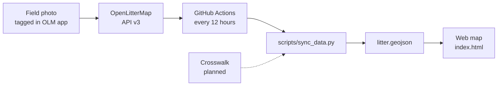

# MROLM — Maple Ridge OpenLitterMap

**An open citizen-science project that turns litter observations from Maple Ridge, British Columbia into a free, automatically updated public map and a locally meaningful dataset.**

Litter is photographed and tagged in the field using [OpenLitterMap](https://openlittermap.com) (OLM). This repository pulls those records from the OLM API, reshapes them for local use, and publishes them as an interactive web map. The goal is evidence that local residents, environmental stewardship groups, and City staff can actually use: where litter concentrates, what it is, and how that changes over time.

*Last updated: September 25, 2026*

---

## Project status at a glance

| Area | Status | Notes |
|---|---|---|
| Data pipeline (OLM API → GeoJSON) | ✅ Built | Runs automatically every 12 hours |
| Public web map | ✅ Built | Three basic filters: Litter, Pet Waste, Nicotine/THC/Alcohol |
| Crosswalk logic and layer tree design | 🟡 In design | Rules are frozen; group assignments are being completed |
| Crosswalk engine (code that applies the crosswalk) | ⬜ Planned | Will read the crosswalk as a CSV file |
| Layer tree map interface | ⬜ Planned | Expandable Group → Subgroup → Layer checkboxes |
| Municipal waste stream review | ⬜ Planned | Maple Ridge and Vancouver categories, after the crosswalk is complete |
| Cleanup of older tags in OLM | 🟡 Ongoing | Tracked in the crosswalk's "OLM data needs fixes" column |

---

## Why this project exists

OpenLitterMap uses one global tagging system for litter everywhere in the world. That's what makes it powerful, but a global category like `other/plastic` or `dumping/dumping` doesn't answer local questions:

- Is illegal dumping in Maple Ridge mostly small household items or large loads?
- Are single-use regulations (like the move to paper straws) showing up in what's actually found on the ground?
- Where are hazards like broken glass, vapes, and loose dog waste concentrated near trails and waterways?

MROLM adds a **local layer of meaning** on top of the OLM data, without changing the original data. Every local category traces back to an exact OLM tag, so the local view stays transparent and reproducible.

---

## How it works



1. **Collect.** Litter is photographed, geotagged, and tagged in the OpenLitterMap app.
2. **Fetch.** A scheduled GitHub Actions workflow (`.github/workflows/sync_data.yml`) runs `scripts/sync_data.py`. The script logs in to the OLM API and requests photos page by page until an empty page comes back.
3. **Reshape.** Each photo's tags are flattened into a simple list. Material, brand, and custom tags stay linked to the item they describe.
4. **Classify.** Each photo currently gets one or more broad groups: `litter`, `pet_waste`, or `substances`. The crosswalk will replace this with much richer local classification.
5. **Publish.** The result is saved as `data/litter.geojson` (plus a copy in `public/data/`). The workflow commits it only if something changed.
6. **Display.** `index.html` loads the GeoJSON into a MapLibre map with filter checkboxes.

### What each map point contains

Each point on the map is one OLM photo. Its properties are:

| Property | Meaning |
|---|---|
| `id` | The OLM photo ID |
| `datetime` | When the photo was taken |
| `filename` | Link to the photo on OLM's storage |
| `tags` | Every tag on the photo, with `type` (standard, material, brand, custom_tag), `category`, `item`, and `quantity`. Material, brand, and custom tags also record `parent_category` and `parent_item`. |
| `groups` | The broad groups this photo falls into |
| `has_litter`, `has_pet_waste`, `has_substances` | Simple true/false flags used by the current map filters |

---

## The crosswalk

The crosswalk is the heart of Stage 2. It's a lookup table that says: *when a photo has this OpenLitterMap tag, treat it as this local object, and show it in this place on the map.*

It is maintained as a Google Sheet by the project maintainer. Once complete, it will be exported to `config/crosswalk.csv` in this repository. The pipeline will read that file on every run, so **changing the map's categories means editing the spreadsheet, not the code.**

### Columns

The code reads columns **by their header name, not their position**, so columns can be added or reordered safely. Renaming a header requires a matching change in the code.

| Column | Used by | Purpose |
|---|---|---|
| OLM key | Code | The OLM category/item, e.g. `softdrinks/cup` |
| with Secondary Modifier | Code | Narrows the match to one app option, e.g. `small` |
| with Material tag | Code | Narrows the match to one material, e.g. `Wood` |
| with Custom Tag | Code | Narrows the match to one custom tag, e.g. `THC` |
| MROLM Group | Code | Top level of the map's layer tree, e.g. `Drinks` |
| MROLM Subgroup | Code | Optional middle level, e.g. `Hot` |
| MROLM local key | Code | The layer name: the checkbox that holds the data |
| include on map | Code | `yes` shows the row on the map; `no` sends it to the "not used" count |
| Layer label (Maple Ridge name), Maple Ridge stream, Flags, Vancouver audit category | Parked | Early proof-of-concept values, to be redesigned in the municipal stream review |
| low occurance group | Retired | Replaced by the layer tree (see decision log) |
| In my sample, Your notes, reason, OLM data needs fixes | People | Documentation and to-do notes; ignored by the code |

### Matching rules

For each tag on a photo, the engine finds exactly one crosswalk row:

1. **Most specific row first.** A row with a modifier, material, or custom tag that matches beats the plain row for that OLM key.
2. **Blank means "anything else."** If a tag has a modifier, material, or custom tag that isn't listed, it falls back to the row where that column is blank. For example, a `softdrinks/bottle` tagged "water" in the app matches the plain `softdrinks/bottle` row.
3. **Matching ignores capitals and extra spaces.** `THC`, `thc`, and `THC ` are treated as the same custom tag.
4. **First match wins.** If one tag matches two specific rows, the row higher in the sheet wins, and the audit report lists every case where this happened.
5. **Nothing is deleted.** Flattening only decides which layer an item appears in. The original material, brand, and custom tags stay in the data, so it remains possible to count, say, cold cups tagged as plastic.

### Audit counts

Every run will produce a small audit report so data problems are visible instead of silent:

| Count | Meaning | Healthy value |
|---|---|---|
| **Not used** | Tags matching a row with `include on map = no` (retired OLM keys) | 0, once older photos are fixed in OLM |
| **Unmapped** | Tags matching no row at all: a gap in the crosswalk | 0 |
| **UNCLASS** | Household dumping photos with no size chosen | 0, once older photos are given a size |
| **Standalone layers** | Layers with no group | Informational: check nothing was missed |
| **Tie-breaks** | Tags that matched more than one row | Informational |

A convention in the sheet supports this: when a row's local key is identical to its OLM key, the key is retired. The code checks that every such row also says `include on map = no` and flags any row where the two disagree.

### Layer tree rules

The map will show an expandable tree of checkboxes, up to three levels deep: **Group → Subgroup → Layer**.

1. **Counts roll up.** A Subgroup's count is the sum of its layers, and a Group's count is the sum of everything inside it.
2. **Counts are items, not photos.** A photo showing 3 cans counts as 3. Photo counts appear in the audit report.
3. **A blank Subgroup is fine.** The layer sits directly under its Group.
4. **A blank Group means standalone.** The layer appears at the top level on its own.
5. **A Subgroup without a Group is an error**, flagged in the audit report.
6. **A Subgroup with only one layer shows as a single checkbox**, with no extra click to expand.
7. **Empty layers are hidden.** A layer with nothing in it doesn't show a checkbox, so to-do layers like UNCLASS disappear once they reach zero.
8. **Checkboxes cascade.** Ticking a Group turns everything inside it on or off. Unticking one layer leaves its parents partly ticked.
9. **Full names outside the tree.** Short layer names like `Sml` only need to make sense in the tree. In popups and exports, the full path is shown, e.g. *Household Dumping – Sml*.

A photo with several kinds of litter appears in every layer that applies to it. That's intended.

### Current tree (work in progress)

```
Drinks
├── Liquor        Bottle Cap, Broken Glass, Can, Debris
├── Hot           Cup, Lid, Coffee Pod, Cup Sleeve
└── Cold          Bottle, Bottle Cap, Broken Glass, Can, Carton, Cup, Lid, Drink Box Pouch
Straw             Household & Food Plastic Straws, Paper Drink Straws, Drink Straw Wrapper
Household Dumping UNCLASS, Sml, Med, Lrg
(remaining rows are standalone until grouped)
```

---

## Field tagging protocol

These are the tagging conventions used when collecting data for this project. They matter because the crosswalk can only be as consistent as the tagging.

| Situation | How it's tagged |
|---|---|
| Household illegal dumping | `dumping/dumping` with a size, measured by the item's longest dimension. **Small:** can be carried away by hand, under 30 cm (e.g. a ladle). **Medium:** can't be carried away but smaller than a fridge or couch, 30–90 cm (e.g. a printer). **Large:** bigger than a full garbage bag, over 90 cm (e.g. an ironing board). Always choose a size; unsized photos land in UNCLASS. |
| Commercial dumping | `dumping/other` |
| Cigarette butts | `smoking/butts`. OLM allows a maximum of 10 per photo, so large clusters are split across photos taken at the same spot. |
| Cannabis products | `smoking/packaging` or `smoking/vape` with the custom tag `THC`. Alcohol keys are no longer used for cannabis. |
| Hot vs cold drinks | Hot takeout cups and lids: `coffee/cup`, `coffee/lid`. Cold drinks, including cold coffee: `softdrinks/cup`, `softdrinks/lid`. |
| Straws | Takeout straws (paper): `softdrinks/straw`. Household plastic straws: `food/straw`. |
| Polystyrene | Whole blocks: `marine/styrofoam`. Fragments: `marine/polystyrene_fragment`. |
| Industrial debris | `industrial/other` for everything industrial except tape, which is `industrial/tape`. |
| Unidentifiable paper | `other/paper`, including napkins and tissue that can't be identified once wet or aged. |
| Party litter | `other/balloon`, with a shared custom tag on every associated item using the pattern `PAR` + date + letter, e.g. `PAR20260922A`. |
| Vehicle parts | `vehicles/car_part`, without a material tag, since materials can't be verified in the field. |
| Out of scope | Civic fixtures and signage (reported to the City instead) and posters, which often name people and could imply wrongdoing unfairly. |

**Retired OLM keys** (not used for new photos; older photos are being reclassified): `alcohol/packaging`, `civic/bags_litter`, `civic/other`, `coffee/straw`, `industrial/pipe`, `other/bags_litter`, `other/poster`, `smoking/box`.

**Fixes happen at the source.** When older photos were tagged inconsistently, they are corrected in OpenLitterMap itself rather than patched in this repository's code. That way, anyone downloading the data from OLM gets the corrected version too.

---

## Decision log

Key design decisions, so the reasoning isn't lost.

| Date | Decision | Why |
|---|---|---|
| 2026-09 | Classification rules live in a spreadsheet (the crosswalk), not in code | The maintainer can change categories without programming |
| 2026-09 | Most specific crosswalk row wins; unlisted modifiers flatten to the plain row | Keeps the sheet small while allowing detail where it matters |
| 2026-09 | Household dumping sizes (small, medium, large) are separate layers | Size changes the response needed, from volunteer pickup to a City truck |
| 2026-09 | A permanent `UNCLASS` row catches dumping photos without a size | Nothing is silently lost; it works whatever code OLM uses for "not sure" |
| 2026-09 | Column `include on map` is the only on/off switch; "local key = OLM key" is a consistency check | Two competing rules would contradict each other |
| 2026-09 | Audit counts for "not used" and "unmapped" | Data problems become visible numbers instead of silent gaps |
| 2026-09 | Liquor packaging reclassified: boxes to `food/box`, whole items to `food/packaging`, pieces by material | Cannabis packaging moved to smoking + `THC`; the alcohol key was inconsistent |
| 2026-09 | The "low occurrence" group is retired; rare items join their logical parent | Richer data: a bottle cap belongs with drinks, not in a miscellaneous pile |
| 2026-09 | Three-level layer tree: Group → Subgroup → Layer | Some topics (like straws or drinks) need a middle level; others don't |
| 2026-09 | Map counts are items, not photos | One photo can hold many items; photo counts go in the audit |
| 2026-09 | Stream columns from the first schema are treated as proof of concept | They'll be rebuilt properly in the municipal stream review |
| 2026-09-24 | An incomplete or empty fetch fails the sync instead of publishing partial data | A 200-page cap had silently cut the map to 1,600 photos; a failed run leaves the last good data live |

---

## Roadmap

### Stage 2 — Local classification (current)

1. **Finish the crosswalk.** Assign Groups and Subgroups to all included rows, fill blank local keys, and export to `config/crosswalk.csv`.
2. **Build the crosswalk engine.** Update `scripts/sync_data.py` to read the CSV, apply the matching rules, and write an audit report alongside the GeoJSON.
3. **Build the layer tree map.** Replace the three fixed checkboxes with the expandable tree, including counts and photo popups.
4. **Clean up older tags in OLM.** Work through the "OLM data needs fixes" column until the audit counts reach zero.
5. **Confirm OLM's modifier codes** (low priority). The app shows labels like "medium" and "skip/not sure"; the exact values the API sends should be confirmed from OLM's open-source code or a raw API response.

### Stage 3 — Municipal waste streams

Map each local layer to three category systems, side by side:

- **MROLM**: this project's own local names
- **COMR**: City of Maple Ridge waste streams
- **COV**: City of Vancouver litter audit categories, for comparison with an established regional study

The map could then offer a "view as" switch between these lenses. This stage includes verifying every bylaw and program reference before it's shared with the City. The draft in `ReadMe/Local Schema Rationale.md` was an early proof of concept and will be revised in this stage.

### Hardening (ongoing)

- ✅ **Protect the published data from partial runs.** Done 2026-09-24: if the API fails partway through, the run stops before writing any files and the map keeps the previous data. The photo limit was also raised from 1,600 to 16,000.
- Add retries with increasing wait times for page requests, not just login (next).
- Write the GeoJSON atomically, so an interrupted run can't leave a half-written file.
- Add automated tests for tag parsing and crosswalk matching.
- Validate coordinates and the GeoJSON structure before publishing.
- Improve map accessibility: keyboard support, screen reader labels, and a text summary of the data.
- Show clear messages if the basemap or data fails to load.
- Simplify the two copies of the GeoJSON into one.

### Later ideas

- Heatmaps and clustering for dense collection routes
- A date slider to show how litter changes over time
- Richer popups with photo previews and brand information

---

## Repository structure

```
.
├── .github/workflows/sync_data.yml   Scheduled workflow that runs the pipeline
├── scripts/sync_data.py              Fetches OLM data and builds the GeoJSON
├── data/litter.geojson               Published dataset
├── public/data/litter.geojson        Copy of the dataset for hosting
├── index.html                        The web map
├── ReadMe/Local Schema Rationale.md  Early schema draft (proof of concept)
└── config/crosswalk.csv              Planned: the crosswalk exported from the spreadsheet
```

---

## Running it yourself

The pipeline needs an OpenLitterMap account. Its email and password are stored as **GitHub repository secrets** named `OLM_EMAIL` and `OLM_PASSWORD` (Settings → Secrets and variables → Actions). They are never written into the code.

- **Automatic:** the workflow runs every 12 hours.
- **On demand:** go to the Actions tab, choose *Sync OpenLitterMap GeoJSON Data*, and click *Run workflow*.
- **Locally:** with Python 3.11 installed:

```bash
pip install requests
export OLM_EMAIL="you@example.com"
export OLM_PASSWORD="your-password"
python scripts/sync_data.py
```

Then open `index.html` through a local web server (for example, `python -m http.server`) rather than directly from the file system, so the browser allows it to load the GeoJSON.

---

## Cost

The project is designed to cost nothing to run.

| Component | Technology | Cost |
|---|---|---|
| Data processing | GitHub Actions | $0 (well within the free monthly minutes) |
| Hosting | GitHub Pages | $0 |
| Map | MapLibre GL JS with CARTO Positron basemap | $0 |
| Storage | GeoJSON files in the repository | $0 |

---

## Data, privacy, and licensing

**Source.** All litter records come from the maintainer's own OpenLitterMap contributions. Photos are hosted by OpenLitterMap; this repository stores only links to them.

**Location precision.** Coordinates are published at the precision OLM records. Collection routes are visible on the map by design. Contributors should avoid uploading photos that reveal their home, identify other people, or show private property details.

**What's deliberately left out.** Posters and signage that name individuals or businesses are not recorded, because a litter map could unfairly imply wrongdoing.

**Licensing.** A license has not been chosen yet. Until one is added, default copyright applies to the code. A common approach for projects like this is an open-source license (such as MIT) for the code, with the data following OpenLitterMap's open data terms. Check OLM's current terms before reusing the data.

---

## Acknowledgements

- [OpenLitterMap](https://openlittermap.com), the open-source, open-data citizen science platform this project is built on
- [MapLibre GL JS](https://maplibre.org) for map rendering
- [CARTO](https://carto.com) for the Positron basemap
- Everyone who picks up litter in Maple Ridge, tagged or not

Questions, ideas, and corrections are welcome through this repository's Issues.
