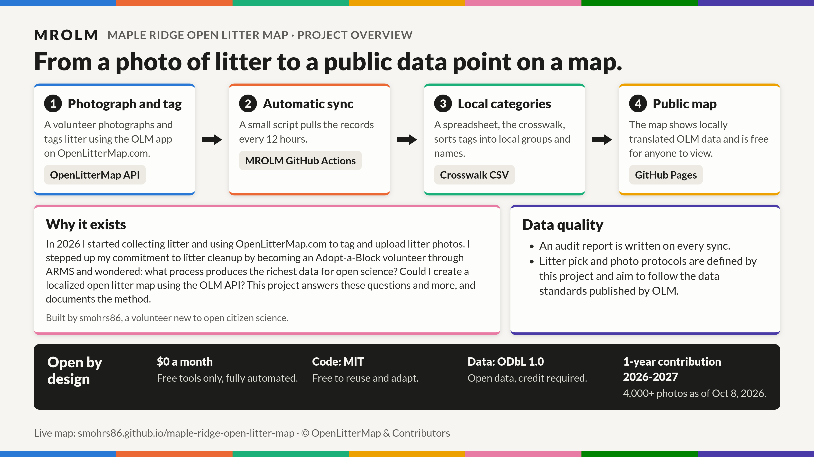
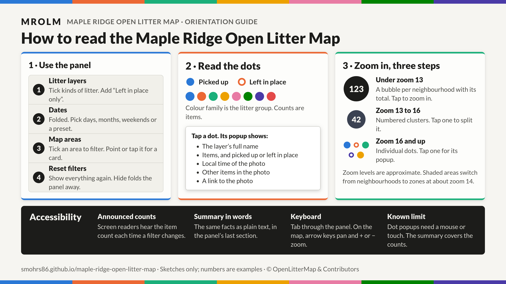
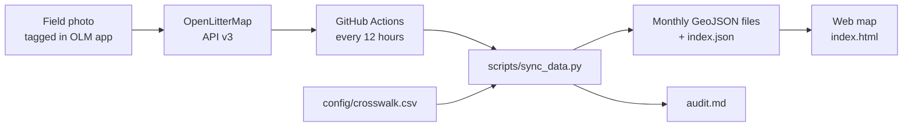

# MROLM · Maple Ridge Open Litter Map

**An interactive web map of citizen-science litter records from Maple Ridge, British Columbia, updated automatically from OpenLitterMap.**

**Live map:** https://smohrs86.github.io/maple-ridge-open-litter-map/

[](assets/project-overview.png)

[](assets/orientation-guide.png)

Litter is photographed and tagged in the field using [OpenLitterMap](https://openlittermap.com) (OLM), an open citizen-science platform. MROLM is an independent volunteer project, not part of OpenLitterMap. It pulls those records from the OLM API every 12 hours, sorts each tagged item into local litter categories, and publishes the result as a free, interactive web map. The goal is good open data for citizen science: a consistent, well-documented record of where litter is, what it is, and how that changes over time.

> **Status: proof of concept achieved (2026-09-27).** The map is live and updates automatically. The cleanup of older tags in OpenLitterMap was finished on 2026-10-02, and the neighbourhood and zone views were added on 2026-10-03.

**Contact:** questions, interest in contributing, or data inquiries: mrolm.unsaved516@simplelogin.com

---

## Why this project exists

In 2026 I started collecting litter and using OpenLitterMap to tag and upload photos of it. I stepped up my commitment to litter cleanup by becoming an Adopt-a-Block volunteer through the Alouette River Management Society (ARMS), and began to wonder what process produces the richest data for open science.

What would a local open litter map look like, or what could it look like? Could I keep taking part in OpenLitterMap's global project and still see my records in local terms? And could a local lookup table, a *crosswalk*, translate OLM's tags into local categories? MROLM is my answer to those questions. *(smohrs86, maintainer)*

OpenLitterMap uses one global tagging system for litter everywhere in the world. That's what makes it powerful, but a global category like `other/plastic` or `smoking/vape` doesn't answer local questions:

- How much of the litter comes from take-out coffee, drinks and snacks?
- Are vapes and smoking packaging mostly nicotine or cannabis?

MROLM adds a **local layer of meaning** on top of the OLM data, without changing the original data. Every local category traces back to an exact OLM tag, so the local view stays transparent and reproducible.

---

## Reading the map

- **One dot per layer per photo.** A photo with cans and cigarette butts gets two dots, drawn a few pixels apart in a small cluster. The cluster is a display offset only; the photo's location is never moved.
- **Colour hints at the group.** Each group has its own colour family (a fixed, colour-blind-tested order that is never recycled), subgroups shift the hue slightly, and layers are lighter or darker shades. With this many layers, colour alone can't identify one, so tick a layer on its own or click a dot: the popup names it in full.
- **Filled dot = picked up, hollow ring = left in place.** A ring means at least one of those items was left where it was found (for example dog waste). **Left in place only** narrows the map to those items.
- **Totals, clusters and dots by zoom.** Zoomed out, each neighbourhood is one bubble with its total items and its name; tap it to zoom in. Zooming in, those fade into numbered clusters (each number is the items the filters count; tap one to zoom into it), and the clusters fade into the individual dots, which can be tapped for details. Every number follows the same checkboxes, dates and "Left in place only" filter. Clusters are one neutral colour and the dots keep the layer colours and the rings for items left in place.
- **Date filter.** From and To dates use Maple Ridge local time. OLM stores times in UTC, so without this, evening collections would land on the next day. The tree's counts follow the chosen dates.
- **Popups** show the full layer name, the item count, picked up or left in place, the local date and time, other layers in the same photo, and a link to the photo on OLM.
- **Dot positions come from the phone's GPS**, so they are usually within about 5 to 15 metres of where the photo was taken, and more near buildings and trees. Zoomed in, a dot can appear on a building near where the litter actually was.

**Try it:**

- There seems to be a lot of littered dog waste. Does Maple Ridge have a dog waste problem? Tick only the Fecal group (Pet Waste Unbagged and Pet Waste Bagged), then point at or tap a neighbourhood to see its card. The counts show where collecting happened, so they describe the areas walked, not the whole city.
- How much of what's found gets picked up, and what has to be left where it is? Tick **Left in place only** to see just the items that were left where they were found, then compare the totals with the filter off.

---

## Local litter categories

OpenLitterMap tags litter with one global list of categories. MROLM sorts each of those tags into local categories with a lookup table called the **crosswalk**: a spreadsheet the maintainer keeps, exported to `config/crosswalk.csv`. Changing a category means editing the spreadsheet, not the code, and every local category traces back to an exact OLM tag.

The categories form a tree of Groups, Subgroups and Layers, the same tree as the checkboxes in the map's panel. The full rules are in [The crosswalk in detail](#the-crosswalk-in-detail).

### Current tree (from `config/crosswalk.csv`, 2026-10-03)

Some layers sit directly under a group, with no subgroup.

```
Household
├── Liquor          Liquor Bottle, Liquor Bottle Cap, Liquor Broken Glass, Liquor Can, Liquor Debris, Liquor Packaging
└── (no subgroup)   Batteries, Plastic (#4) or Paper Food Bag, Corrugated Cardboard Box, Household Food Can,
                    Food Container - Plastic, Paper, Foam, Food Container Lid, Organic Debris, Misc.,
                    Plastic Straws, Medical Bandages, Latex / Nitrile Glove, Party Litter,
                    Abandoned Textile Apparel, Household misc, E-waste Piece, Household Plastic Bag,
                    Pet Supplies, Dental Waste, Cotton Swabs, Personal Hygiene Product, Hygiene Paper, Wet Wipes
Convenient Food Drink
├── Drink           Poly-lined Hot Beverage Cup, Hot Beverage Cup Lid, Single-Serve Coffee Pod,
│                   Corrugated Cardboard Cup Sleeve, Plastic or Glass Drink Bottle, Drink Bottle Cap,
│                   Drink Broken Glass, Aluminum Drink Cans, Drink Carton, Cold Beverage Cup, Drink Box Pouch,
│                   Cold Beverage Lid, Household or Take-out Drink Packaging, Pull-tabs, Paper Drink Straws,
│                   Drink Straw Wrapper
├── Snack           Metalized Chip Bags, Chewed Gum, Foil / Plastic Film Snack Wrapper
└── Take-out        Cutlery, Napkins, Food Packaging, Condiment Packets
Dumping             UNCLASS, Sml, Med, Lrg, Commercial Dumping
Industrial          Industrial Debris, Flagging Tape
Piece               Foil Piece, Styrofoam Piece, Styrofoam Whole, Household or Unknown Metal Piece, Wood Debris,
                    Broken Glass Piece, Paper Piece, Plastic Piece, Motor Vehicle Part Piece, Motor Vehicle Spill
Fecal               Pet Waste Unbagged, Pet Waste Bagged
Smoking             Cigarette Butts, Butane Lighter, Nicotine Packaging, Cannabis Packaging, Nicotine Vape,
                    Cannabis Vape
```

Under Dumping, Sml, Med and Lrg are the size of the dumped load. UNCLASS holds dumping with no size chosen yet; it is empty now, and an empty layer is hidden on the map.

---

## How it works


```mermaid
flowchart LR
    A[Field photo<br/>tagged in OLM app] --> B[OpenLitterMap<br/>API v3]
    B --> C[GitHub Actions<br/>every 12 hours]
    C --> D[scripts/sync_data.py]
    D --> E[Monthly GeoJSON files<br/>+ index.json]
    E --> F[Web map<br/>index.html]
    X[config/crosswalk.csv] --> D
    D --> G[audit.md]
```

1. **Collect.** Litter is photographed, geotagged, and tagged in the OpenLitterMap app.
2. **Fetch.** A scheduled GitHub Actions workflow (`.github/workflows/sync_data.yml`) runs `scripts/sync_data.py`. The script logs in to the OLM API and fetches new and recent photos. Once a week it rechecks every photo.
3. **Reshape.** Each photo's tags are flattened into a simple list. Material, brand, and custom tags stay linked to the item they describe.
4. **Classify.** The script reads `config/crosswalk.csv` and gives every tagged object its Group, Subgroup, and Layer, following the matching rules below. If the crosswalk is missing or a column it needs was renamed, the run stops before writing anything.
5. **Publish.** The result is saved as one file per month in `data/months/` with `data/index.json` (the map reads these), and still as `data/litter.geojson` (plus a copy in `public/data/`) for now, with the audit report in `data/audit.md`. The workflow commits them only if something changed. It also runs as soon as a new `config/crosswalk.csv` is pushed.
6. **Display.** `index.html` loads the GeoJSON into a MapLibre map with the layer tree, a date filter, and photo popups.

---

## Using the data

The data is free to reuse under the ODbL 1.0, with the credit "© OpenLitterMap & Contributors" (see [Data, privacy, and licensing](#data-privacy-and-licensing)). The files are:

- `data/months/YYYY-MM.geojson`: one GeoJSON file per month, one point per photo
- `data/index.json`: lists the monthly files with their photo counts, and carries the full layer tree in display order (`mrolm_layers`), the neighbourhoods and the zones
- `data/litter.geojson`: the whole dataset in one file (being retired)
- `data/audit.md`: the audit report from the latest sync

Each file can be downloaded from the live site by adding its path to the map's address, for example https://smohrs86.github.io/maple-ridge-open-litter-map/data/index.json.

### What each map point contains

Each point on the map is one OLM photo. Its properties are:

| Property | Meaning |
|---|---|
| `id` | The OLM photo ID |
| `datetime` | When the photo was taken |
| `filename` | Link to the photo on OLM's storage |
| `tags` | Every tag on the photo, with `type` (standard, material, brand, custom_tag), `category`, `item`, and `quantity`. Standard tags may also carry `object_type`, the type OLM saved for the object (for example a dumping size or a drink type); it is absent when none was chosen. Material, brand, and custom tags also record `parent_category` and `parent_item`. |
| `objects` | One entry per tagged object, as classified by the crosswalk: `status` (OK, REVIEW, RECLASS, UNCLASS, ORPHAN TAG, or UNMAPPED), `on_map`, `group`, `subgroup`, `layer`, `full_name`, `olm_key`, `quantity`, and `picked_up` (true, false, or null when OLM didn't say). Orphan tags also list their `custom_tags`, and tie-breaks list the tied sheet rows in `tie_rows`. |
| `groups`, `has_litter`, `has_pet_waste`, `has_substances` | The Stage 1 broad groups and flags. No longer used by the map; kept so older copies of the map keep working |

---

## Data, privacy, and licensing

**Source.** All litter records come from the maintainer's own OpenLitterMap contributions. The sync reads one OLM account, so photos from other OpenLitterMap contributors in Maple Ridge do not appear on this map. If you'd like to help, use the contact address at the top. Photos are hosted by OpenLitterMap; this repository stores only links to them.

**What's published.** Each map point contains only these fields: photo ID, date and time, a link to the photo on OpenLitterMap, litter tags, each tagged object's crosswalk layer and picked-up status, and the Stage 1 group flags. The audit report adds counts and photo IDs. Location comes from latitude and longitude only. Any other information OpenLitterMap supplies with a record is outside this project's scope and is discarded by the pipeline before anything is saved.

**Location precision.** Coordinates are published at the precision OLM records. They come from the phone's GPS when the photo was taken, which is usually accurate to about 5 to 15 metres, so a dot can sit on a nearby building rather than on the sidewalk where the litter was. Dots are never moved or snapped to roads. Collection routes are visible on the map by design. Photos are framed to keep faces, licence plates, house numbers and other personal details out of the shot (see the [tagging protocol](docs/tagging-protocol.md)).

**What's deliberately left out.** Posters and signage that name individuals or businesses are not recorded, because a litter map could unfairly imply wrongdoing.

**Licensing.** The code is under the [MIT License](LICENSE). The litter data (`data/` and `public/data/`) is derived from OpenLitterMap, so it follows OpenLitterMap's data license, the [Open Database License (ODbL) 1.0](https://opendatacommons.org/licenses/odbl/1-0/): anyone may reuse it with the credit "© OpenLitterMap & Contributors", and adapted versions that are shared publicly must stay under the ODbL. See [data/LICENSE.md](data/LICENSE.md). The map shows the same credit in its attribution corner.

---

## Cost

The project is designed to cost nothing to run.

| Component | Technology | Cost |
|---|---|---|
| Data processing | GitHub Actions | $0 (well within the free monthly minutes) |
| Hosting | GitHub Pages | $0 |
| Map | MapLibre GL JS with CARTO Positron basemap | $0 |
| Storage | GeoJSON files in the repository | $0 |

---

## Project status

| Area | Status | Notes |
|---|---|---|
| Data pipeline (OLM API → GeoJSON) | ✅ Built | Runs automatically every 12 hours |
| Public web map | ✅ Built | MapLibre map on GitHub Pages |
| Crosswalk logic and layer tree design | ✅ Designed | Exported to `config/crosswalk.csv`. Structure reviewed and clean |
| Crosswalk engine (code that applies the crosswalk) | ✅ Built | Reads `config/crosswalk.csv` on every sync and writes an audit report, `data/audit.md` |
| Layer tree map interface | ✅ Built | Group → Subgroup → Layer checkboxes, picked-up rings, date filter, popups |
| GIS features on the map | ✅ Built | Stage 3 complete 2026-10-03: a neighbourhood total, then numbered clusters, then dots by zoom level, neighbourhood and zone views with hover cards, date selection, and a Reset filters button |
| Municipal waste stream | ⬜ Only if COMR takes part | A view in the City of Maple Ridge's own litter categories, built only if the City publishes or uses them (Stage 4) |
| Cleanup of older tags in OLM | ✅ Done | The maintainer reviewed every photo and reclassed legacy tags in OLM (roadmap step 4), completed 2026-10-02 |

### Proof of concept: achieved (2026-09-27)

The proof of concept asked one question: can litter records made with OpenLitterMap's global tagging schema be translated into local terms, with a crosswalk the maintainer controls as the tool that manages the local schema? It can. The live map shows every tagged item in local categories, and changing a category means editing the crosswalk, not the code.

The original criteria, with 5 and 8 moved to refinements because they improve quality rather than test the idea (5 was completed 2026-10-02):

1. ✅ **The engine applies the crosswalk.** Every run reads `config/crosswalk.csv` and puts each tag into exactly one layer, following the matching rules below. Unmapped = 0.
2. ✅ **The audit report is published on every run**, with the counts in the audit table below. Tie-breaks are reviewed and either fixed in the crosswalk or accepted.
3. ✅ **The layer tree works on the live map:** Group → Subgroup → Layer checkboxes that cascade, item counts that roll up, empty layers hidden, and full layer names in popups.
4. ✅ **Counts are spot-checked.** For about five layers, the map count matches a manual count of the same tags in OLM.
5. ✅ **Legacy data is conformed enough to trust** (completed 2026-10-02, after a full photo review and 166 photos retagged in OLM). Not used = 0 and UNCLASS = 0. Orphan tags are tracked in the audit with their photo IDs and fixed in OLM, or accepted as a known gap. The REVIEW backlog reached 0 on 2026-10-03, after the review notes were cleared from the crosswalk.
6. ✅ **The pipeline stays safe.** An incomplete fetch leaves the last good data live, and the tree map data is produced by the workflow without manual fixes.
7. ✅ **A basic test exists** for crosswalk matching: a specific row beats the plain row, blank falls back, capitals and spacing are ignored, and the first match wins.
8. ➡️ *Refinement:* **A newcomer can understand it in five minutes.** The README opens with what the map shows, and the live link works.

Not part of the proof of concept: GIS features, municipal streams, a license, and a contributor guide.

---

## The crosswalk in detail

Related docs: [field tagging protocol](docs/tagging-protocol.md) (how items are tagged in the field) and [decision log](docs/decision-log.md) (why the design is the way it is).

The crosswalk is the heart of Stage 2. It's a lookup table that says: *when a photo has this OpenLitterMap tag, treat it as this local object, and show it in this place on the map.*

It is maintained as a Google Sheet by the project maintainer. It is exported to `config/crosswalk.csv` in this repository. The pipeline reads that file on every run, so **changing the map's categories means editing the spreadsheet, not the code.** After an edit, the whole sheet is exported and pushed, and the map updates within minutes.

The local categories were built using the City of Vancouver litter audit and Maple Ridge municipal classifications as guides.

### Columns

The code reads columns **by their header name, not their position**, so columns can be added or reordered safely. Renaming a header requires a matching change in the code.

| Column | Used by | Purpose |
|---|---|---|
| OLM key | Code | The OLM category/item, e.g. `softdrinks/cup` |
| with Secondary Modifier | Code | Narrows the match to one app option, e.g. `small` |
| with Material tag | Code | Narrows the match to one material, e.g. `Wood` |
| with Custom Tag | Code | Narrows the match to one custom tag, e.g. `THC` |
| MROLM Group | Code | Top level of the map's layer tree, e.g. `Drinks` |
| MROLM Subgroup | Code | Optional middle level, e.g. `Hot` |
| MROLM local key | Code | The layer name: the checkbox that holds the data |
| include on map | Code | `yes` shows the row on the map; `no` sends it to the "not used" count |
| low occurance group | Retired | Replaced by the layer tree (see the [decision log](docs/decision-log.md)) |
| Notes, reason, OLM data needs fixes | People | Documentation and to-do notes; ignored by the code |

### Matching rules

For each tag on a photo, the engine finds exactly one crosswalk row:

1. **Most specific row first.** A row with a modifier, material, or custom tag that matches beats the plain row for that OLM key.
2. **Blank means "anything else."** If a tag has a modifier, material, or custom tag that isn't listed, it falls back to the row where that column is blank. For example, a `softdrinks/bottle` tagged "water" in the app matches the plain `softdrinks/bottle` row.
3. **Matching ignores capitals and extra spaces.** `THC`, `thc`, and `THC ` are treated as the same custom tag.
4. **First match wins.** If one tag matches two specific rows, the row higher in the sheet wins, and the audit report lists every case where this happened.
5. **Nothing is deleted.** Flattening only decides which layer an item appears in. The original material, brand, and custom tags stay in the data, so it remains possible to count, say, cold cups tagged as plastic.

### Audit counts

Every run writes a small audit report, [`data/audit.md`](data/audit.md), so data problems are visible instead of silent. It also lists REVIEW and Not used objects by OLM key, orphan tags and unmapped tags with photo IDs, crosswalk structure checks, and every layer's items, photos, and not-picked-up items:

| Count | Meaning | Healthy value |
|---|---|---|
| **Not used** | Tags matching a row with `include on map = no` (retired OLM keys) | 0, once older photos are fixed in OLM |
| **Unmapped** | Tags matching no row at all: a gap in the crosswalk | 0 |
| **UNCLASS** | Household dumping photos with no size chosen | 0, once older photos are given a size |
| **Standalone layers** | Layers with no group | Informational: check nothing was missed |
| **Orphan tags** | Custom tags attached to no object (usually typos or leftovers). Listed by photo ID, kept off the map layers, and fixed in OLM | 0 |
| **Tie-breaks** | Tagged objects that matched more than one equally specific row, for example one object with both a matching material and a matching custom tag | Informational |

A convention in the sheet supports this: when a row's local key is identical to its OLM key, the key is retired. The code checks that every such row also says `include on map = no` and flags any row where the two disagree.

### Layer tree rules

The map shows an expandable tree of checkboxes, up to three levels deep: **Group → Subgroup → Layer**.

1. **Counts roll up.** A Subgroup's count is the sum of its layers, and a Group's count is the sum of everything inside it.
2. **Counts are items, not photos.** A photo showing 3 cans counts as 3. Photo counts appear in the audit report.
3. **A blank Subgroup is fine.** The layer sits directly under its Group.
4. **A blank Group means standalone.** The layer appears at the top level on its own.
5. **A Subgroup without a Group is an error**, flagged in the audit report.
6. **A Subgroup with only one layer shows as a single checkbox**, with no extra click to expand.
7. **Empty layers are hidden.** A layer with nothing in it doesn't show a checkbox, so to-do layers like UNCLASS disappear once they reach zero.
8. **Checkboxes cascade.** Ticking a Group turns everything inside it on or off. Unticking one layer leaves its parents partly ticked.
9. **Full names outside the tree.** Short layer names like `Sml` only need to make sense in the tree. In popups and exports, the full path is shown, e.g. *Dumping – Sml*.

A photo with several kinds of litter appears in every layer that applies to it. That's intended.

---

## Roadmap

### Stage 2 — Local classification (done)

Priority order: the code that applies the crosswalk and displays the points (steps 2 and 3), then the legacy review and reclass (step 4, which is the largest amount of human effort), then Stage 3, then Stage 4.

1. ✅ **Finish the crosswalk.** Done 2026-09-25: exported to `config/crosswalk.csv`, with structural checks clean and no unmapped tags in the current data.
2. ✅ **Build the crosswalk engine.** Done 2026-09-26: `scripts/sync_data.py` reads the CSV, applies the matching rules, and writes `data/audit.md` alongside the GeoJSON.
3. ✅ **Build the layer tree map.** Done 2026-09-26: the expandable tree with counts, picked-up rings, a date filter, and photo popups replaced the three fixed checkboxes.
4. ✅ **Clean up older tags in OLM.** Done 2026-10-02: the maintainer reviewed every photo and reclassed tagged objects directly in OLM. This covered tags on retired or excluded keys, tags the crosswalk flagged for review ("OLM data needs fixes"), and orphan custom tags (custom tags attached to no object). The audit counts for these are now 0.
5. ✅ **Confirm OLM's modifier codes.** Done 2026-09-25: the API sends an object's type as `type` (`new_tags` format) or `type_id` (summary format), and the pipeline keeps it as `object_type`. `small` and `medium` are confirmed in real data; `large` has not appeared yet.

### Stage 3 — GIS features on the map (done 2026-10-03)

Once the layer tree works and the legacy data is conformed, add features that make the spatial data easier to read:

- ✅ Clustering with a neighbourhood total, clusters, dots zoom sequence (2026-10-03). A heatmap was built early (2026-09-26) and removed
- ✅ Neighbourhood and zone views (built 2026-10-02): the City of Maple Ridge's neighbourhoods when zoomed out and lettered zones inside them when zoomed in (A at the top), with a checkbox tree in the panel (a neighbourhood and its zones) to show or hide each. Pointing at an area, or its row in the key, shows its label and one card (items, items left in place, photos, collection days, most common layers, and how many photos sit within the assumed GPS error of an edge; a neighbourhood card ranks its zones). Zones sit where there are photos and edges go where collecting is sparse, so GPS drift matters little. A density score was considered and dropped. How and why: [docs/zones-method.md](docs/zones-method.md). The neighbourhoods come from the Planning Department's map: see [docs/maple-ridge-community-areas.md](docs/maple-ridge-community-areas.md)
- ✅ Date selection (built 2026-10-02): the panel picks a set of collection days with a tick list of the days (with items per day), month chips, weekday and weekend chips, presets (All, None, Last 7 days, Last 30 days) and the From/To boxes. A chip ticks or unticks its days, so months can be mixed. Time of day, comparing two groups side by side, and a click-and-drag strip of photos per day are still open
- ✅ Richer popups (achieved; confirmed by the maintainer 2026-10-03): a dot's popup shows the layer's full name, items, picked-up status, local time, the other items in the same photo, and a link to the photo. It links to the photo rather than embedding a preview.

### Stage 4 — Municipal waste stream (only if COMR takes part)

Stage 3's neighbourhood summaries already describe the data in the City's own geography. Stage 4 would go further and show the objects in the City of Maple Ridge's own litter categories, as a "view as" switch on top of the MROLM layer tree. It needs the City to publish or use a litter-count scheme and to take an interest, because MROLM's groups are a volunteer's logic and a stream is only meaningful if it follows the City's own categories. If that happens, each object class is matched to the City's scheme, one stream at a time. There is no stream for any other city, because the map shows Maple Ridge and a second city's categories would confuse readers. The project is complete without Stage 4.

Ongoing reliability work is listed in [docs/hardening.md](docs/hardening.md).

---

## Repository structure

```
.
├── .github/workflows/sync_data.yml   Workflow that runs the pipeline (every 12 hours and on crosswalk changes)
├── scripts/sync_data.py              Fetches OLM data, applies the crosswalk, writes the GeoJSON and audit
├── scripts/monthly_store.py          Reads and writes the monthly data files and index
├── scripts/crosswalk.py              The crosswalk matching rules, shared by the pipeline and review tools
├── scripts/export_raw_olm.py         Read-only raw export for the legacy review (local use)
├── scripts/build_review_workbook.py  Builds the legacy review workbook from an export (local use)
├── scripts/build_photo_gallery.py   Local photo gallery for the legacy review (never published)
├── scripts/build_review_page.py     Local review page built from the review workbook (never published)
├── scripts/merge_review_edits.py    Merges review page edits into the review workbook
├── scripts/olm_batch_replace.py     Dry run of a batch tag fix in OLM (sends nothing)
├── scripts/olm_batch_send.py        Sends one checked photo's tag fix to OLM, then reads it back
├── tests/                            Unit tests: python3 -m unittest discover -s tests
├── data/months/YYYY-MM.geojson       Published dataset, one file per month
├── data/index.json                   Lists the months; carries the layer tree, neighbourhoods and zones
├── data/litter.geojson               Whole dataset in one file (being retired)
├── data/audit.md                     Audit report from the latest sync
├── public/data/litter.geojson        Copy of the dataset for hosting
├── index.html                        The web map (zoom levels and other settings are constants at the top)
├── sitemap.xml                       One-page sitemap for Google Search Console
├── assets/                           Favicon, link-preview image, project overview and orientation guide
├── docs/                             Progress log, tagging protocol, decision log, hardening list, batch review method, zones method, Maple Ridge neighbourhood sources
├── config/crosswalk.csv              The crosswalk, exported from the spreadsheet
├── config/neighbourhoods.csv         The map's neighbourhoods and their colours
├── config/zones.csv                  The lettered zones inside each neighbourhood (rectangles)
├── data/LICENSE.md                   Data license (ODbL 1.0, from OpenLitterMap)
└── LICENSE                           Code license (MIT)
```

---

## Running it yourself

The pipeline needs an OpenLitterMap account. Its email and password are stored as **GitHub repository secrets** named `OLM_EMAIL` and `OLM_PASSWORD` (Settings → Secrets and variables → Actions). They are never written into the code.

- **Automatic:** the workflow runs every 12 hours, and whenever a push changes `config/crosswalk.csv`. OLM lists photos newest first, page by page, so a normal run stops once it reaches photos it already has (after reading at least the newest 25 pages). A full read, which continues until an empty page comes back, runs on Sundays, on request, and when the crosswalk, the neighbourhood or zone files, or the data format change.
- **On demand:** go to the Actions tab, choose *Sync OpenLitterMap GeoJSON Data*, and click *Run workflow*.
- **Locally:** with Python 3.11 installed:

```bash
pip install requests
export OLM_EMAIL="you@example.com"
export OLM_PASSWORD="your-password"
python scripts/sync_data.py
```

To test without logging in, build from a saved raw export instead: `python scripts/sync_data.py --from-raw review/raw/photos_<date>.json` (see the [batch review method](docs/olm-batch-review-method.md) for making one). Run the unit tests with `python3 -m unittest discover -s tests`.

Then open `index.html` through a local web server (for example, `python -m http.server`) rather than directly from the file system, so the browser allows it to load the GeoJSON.

After a local test run, restore the data files with `git restore data/ public/data/` and don't commit them. The workflow publishes the data.

---

## Recent changes

The five newest entries. The full log, one dated line per change, is in [docs/progress-log.md](docs/progress-log.md).

- **2026-10-08:** Decision log: dots will not be shifted to an inferred side of the street; published coordinates stay exactly as OLM recorded them. No change to the map or data.
- **2026-10-08:** Tagging protocol: from 2026-10-07, streets are worked with the road always on the collector's right, so the side of the street can later be worked out from the direction of travel (GPS often can't tell the two sidewalks apart). Earlier outings don't follow this reliably. No change to the map or data.
- **2026-10-08:** README rewritten for newcomers: reordered (visitors, then data users, then maintainers), the full progress log moved to `docs/progress-log.md` with the five newest lines kept in the README, and out-of-date status, roadmap and pipeline text corrected. "Why this project exists" now opens with the maintainer's own story (collecting litter and tagging it on OpenLitterMap in 2026, then becoming an Adopt-a-Block volunteer through ARMS) and two local questions; "Reading the map" ends with two "Try it" examples; the data section says only the maintainer's photos are mapped and gives a download link. The project overview slide (`assets/project-overview.png`) tells the same story, with 4,000+ photos as of 2026-10-08. No change to the map or data.
- **2026-10-07:** Growth plan for about 1,500 new photos a week. The sync now reads only new and recent photos (the newest 25 pages, plus any page that still holds unstored photos), and does a full read of OLM on Sundays, on request (Run workflow, tick *full*), and whenever the crosswalk or zone files change. Data is also written as one file per month, `data/months/YYYY-MM.geojson`, plus `data/index.json`, so a sync normally changes only the newest month. The map reads the monthly files and falls back to `data/litter.geojson` if anything is wrong. The old single files are still written during the transition and will be retired after a few clean syncs. See the decision log (2026-10-07).
- **2026-10-07:** Raised the sync's page safety limit from 2,000 to 20,000 pages (16,000 to 160,000 photos). At the planned collecting rate (about 1,500 photos a week) the old limit would have stopped updates in early December. A plan for incremental sync and monthly data files follows.

---

## Acknowledgements

- [OpenLitterMap](https://openlittermap.com), the open-source, open-data citizen science platform this project is built on
- [MapLibre GL JS](https://maplibre.org) for map rendering
- [CARTO](https://carto.com) for the Positron basemap
- Everyone who picks up litter in Maple Ridge, tagged or not

Questions, ideas, and corrections are welcome through this repository's Issues.
